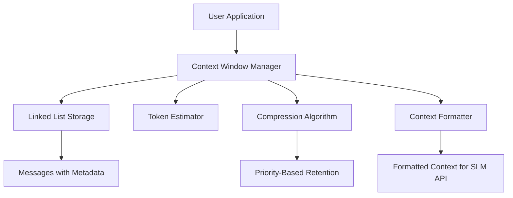
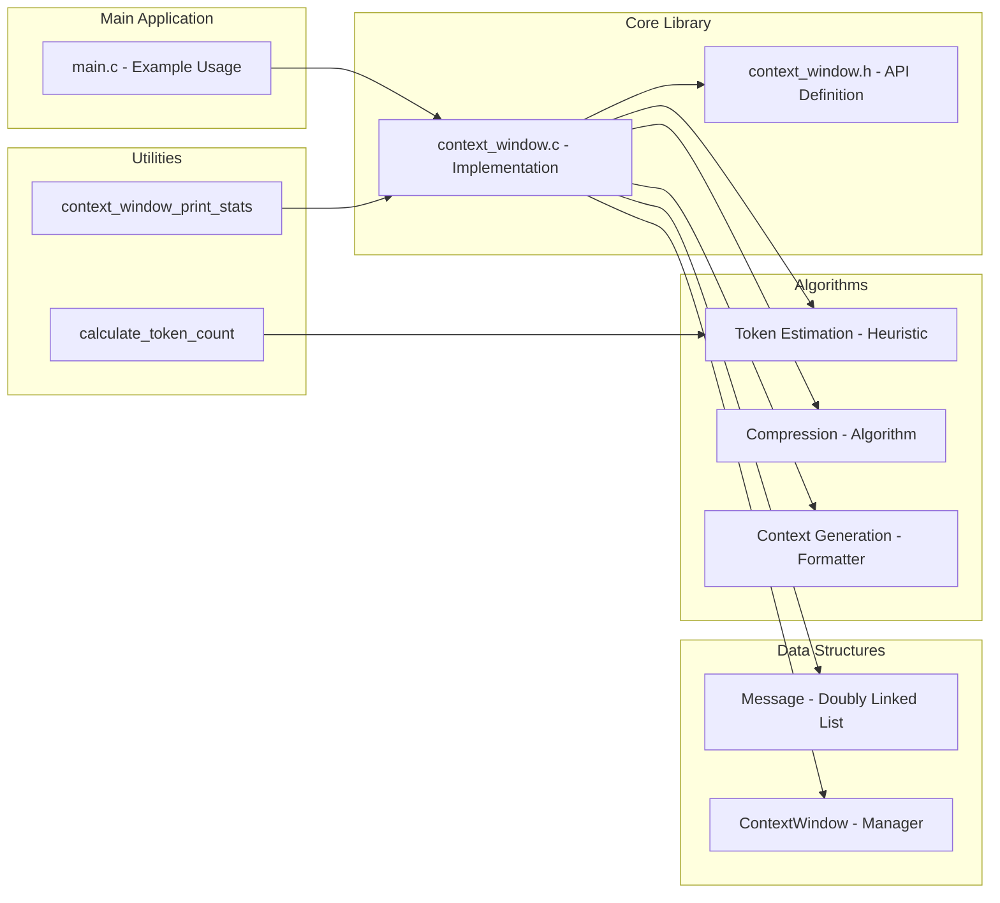
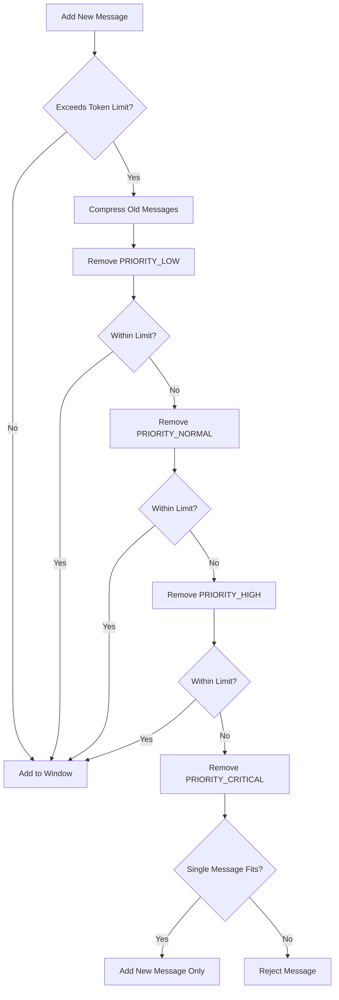

# SLM Context Window Manager - Design Document

## 1. Introduction

The SLM Context Window Manager is a C-based system designed to efficiently manage conversation history within the limited context window constraints of modern Small Language Models (SLMs). This document provides a comprehensive design overview, including architectural decisions, data structures, algorithms, and implementation details.

## 2. System Overview

### 2.1 Problem Statement

SLMs like GPT-3/4, Claude, and Llama have fixed context window sizes that limit the amount of conversation history they can process in a single request. When conversations exceed this limit, SLMs either reject the request or truncate the history arbitrarily, often losing critical context.

### 2.2 Key Objectives

The system addresses these challenges by implementing:

- **Sliding Window Technique**: Maintains a contiguous window of messages within the token limit
- **Priority-Based Message Retention**: Ensures important messages are retained
- **Approximate Token Counting**: Fast heuristic-based token estimation
- **Dynamic Compression**: Removes or compresses old messages when token limits are exceeded
- **Formatted Output**: Generates optimized context strings ready for SLM API consumption

## 3. Architecture Design

### 3.1 High-Level Architecture



### 3.2 Component Diagram



## 4. Data Structures

### 4.1 Message Structure

```c
typedef struct Message {
    MessageType type;              // Type of message
    MessagePriority priority;      // Importance level
    char* content;                 // Message content
    int token_count;               // Token estimation
    struct Message* next;          // Next node pointer
    struct Message* prev;          // Previous node pointer
} Message;
```

### 4.2 Context Window Structure

```c
typedef struct ContextWindow {
    Message* head;                 // Head of the message queue
    Message* tail;                 // Tail of the message queue
    int total_tokens;              // Total tokens in window
    int max_tokens;                // Token limit
    int message_count;             // Number of messages
} ContextWindow;
```

### 4.3 Key Enumerations

```c
typedef enum {
    MESSAGE_USER,
    MESSAGE_ASSISTANT,
    MESSAGE_SYSTEM,
    MESSAGE_TOOL
} MessageType;

typedef enum {
    PRIORITY_LOW,
    PRIORITY_NORMAL,
    PRIORITY_HIGH,
    PRIORITY_CRITICAL
} MessagePriority;
```

## 5. Algorithms and Core Logic

### 5.1 Token Estimation

**Algorithm**: Simple heuristic-based estimation
- **Heuristic**: 1 token ≈ 4 characters (worst-case approximation)
- **Formula**: `token_count = (str_length + 3) / 4`
- **Advantages**: Fast calculation without complex NLP libraries
- **Trade-offs**: Less accurate than real tokenizers but much faster

### 5.2 Sliding Window Technique

**Algorithm**: Maintains a contiguous window of messages within token limit
- New messages are added to the **tail**
- Old messages are removed from the **head** when limits are exceeded
- Handles overflow by compressing existing messages

### 5.3 Priority-Based Compression

**Algorithm**: Multi-level compression strategy

```
1. First, remove all PRIORITY_LOW messages
2. If still over limit, remove PRIORITY_NORMAL messages
3. If still over limit, remove PRIORITY_HIGH messages
4. As a last resort, remove PRIORITY_CRITICAL messages (rare)
```

**Implementation Flow**:



## 6. API Design

### 6.1 Core Functions

```c
// Context Window Management
ContextWindow* context_window_create(int max_tokens);
void context_window_destroy(ContextWindow* window);

// Message Handling
bool context_window_add_message(ContextWindow* window, MessageType type, 
                               MessagePriority priority, const char* content);
char* context_window_get_context(ContextWindow* window);
int context_window_get_message_count(ContextWindow* window);
int context_window_get_token_count(ContextWindow* window);

// Utility Functions
int calculate_token_count(const char* text);
void context_window_print_stats(ContextWindow* window);
```

### 6.2 Design Patterns Used

#### Factory Pattern (Message Creation)
- `create_message()` function encapsulates message construction
- Handles memory allocation and initialization

#### Queue Pattern
- FIFO behavior for normal message handling
- Supports sliding window operations

#### Iterator Pattern
- Linked list traversal for message processing
- Allows for flexible message compression algorithms

## 7. Memory Management

### 7.1 Dynamic Memory Allocation

- Each message's content is duplicated using `strdup()` for safety
- `context_window_destroy()` cleans up all resources
- Error handling for memory allocation failures

### 7.2 Memory Structure

```
ContextWindow
├── head: Message* (points to first message)
├── tail: Message* (points to last message)
├── total_tokens: int
├── max_tokens: int
└── message_count: int

Message
├── type: MessageType
├── priority: MessagePriority
├── content: char* (dynamically allocated string)
├── token_count: int
├── next: Message* (points to next message)
└── prev: Message* (points to previous message)
```

## 8. Performance Characteristics

### 8.1 Time Complexity

| Operation | Time Complexity | Notes |
|-----------|-----------------|-------|
| Adding a message | O(n) worst case | Due to compression; O(1) amortized |
| Removing a message | O(1) | Direct node removal from linked list |
| Calculating context string | O(n) | Traversal needed to build string |
| Token estimation | O(1) | Constant time heuristic calculation |

### 8.2 Space Complexity

- O(n) where n is the number of messages
- Each message typically uses ~100-200 bytes of overhead (plus content storage)
- Can handle thousands of messages per 1MB of memory

### 8.3 Compression Speed

Fast heuristic-based compression ensures low latency even with large numbers of messages.

## 9. Extensibility Design

The architecture is designed to be easily extensible:

### 9.1 Token Estimation

- Current: Simple heuristic (4 chars per token)
- Extensibility: Can be replaced with real tokenizers (Hugging Face, etc.)

### 9.2 Compression Algorithms

- Current: Priority-based removal
- Extensibility: Can be extended with ML-based summarization

### 9.3 Message Types

New message types can be added by extending the `MessageType` enum.

### 9.4 Priority Levels

Additional priority levels can be added by extending `MessagePriority`.

## 10. Error Handling and Robustness

### 10.1 Error Conditions Handled

- Memory allocation failures
- Messages larger than context window
- NULL pointer inputs
- Token limit violations

### 10.2 Recovery Strategies

- Graceful degradation when memory fails
- Message rejection with appropriate error messages
- Complete cleanup of resources in all error scenarios

## 11. Testing Strategy

### 11.1 Test Coverage

```c
void test_create_destroy();        // Creation and cleanup
void test_add_messages();          // Basic message operations
void test_token_calculation();     // Token estimation
void test_sliding_window();        // Window behavior
void test_priority_handling();     // Priority-based retention
void test_get_context();           // Context generation
```

### 11.2 Test Framework

- Simple assert-based testing
- Makefile integration for easy test execution
- Manual verification via examples

## 12. Build System

### 12.1 Makefile Targets

```makefile
all: Build library and test suite
test: Run all tests
run: Execute example program
clean: Remove compiled files
```

### 12.2 Compilation

- GCC compiler (version 4.0 or later)
- Standard C library dependencies
- POSIX-compliant system required

## 13. Usage Scenarios

### 13.1 Direct API Integration

```c
char* context = context_window_get_context(window);
send_slm_request(context, completion_callback);
free(context);
```

### 13.2 Web Application Backend

```c
char* user_message = get_user_input();
context_window_add_message(window, MESSAGE_USER, PRIORITY_HIGH, user_message);

char* api_context = context_window_get_context(window);
char* ai_response = call_slm_api(api_context);

context_window_add_message(window, MESSAGE_ASSISTANT, PRIORITY_NORMAL, ai_response);
send_response_to_client(ai_response);

free(api_context);
free(ai_response);
```

## 14. Future Enhancements

### 14.1 Short-Term Improvements

1. **Intelligent Summarization**: Compress old messages by generating concise summaries
2. **Topic Detection**: Group related messages and retain key topics

### 14.2 Long-Term Features

1. **User Preferences**: Allow custom priority rules based on user-defined patterns
2. **Tokenization**: Integrate with real tokenizers like Hugging Face's tokenizers
3. **Configuration**: Support external configuration files for system parameters

## 15. Conclusion

The SLM Context Window Manager provides an efficient and robust solution for managing conversation history within SLM context window constraints. Its design balances performance, simplicity, and extensibility, making it suitable for integration into various SLM-based applications.
